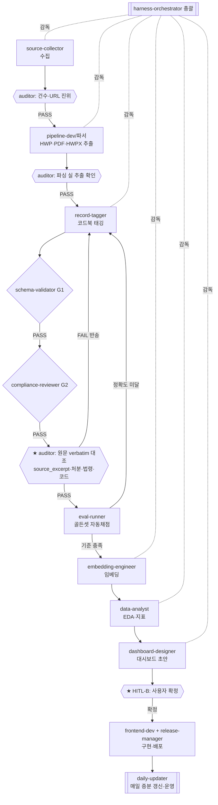

# 에이전트 구성안 (실행·운영 상세) — 감사 선례 도우미

> 기준일: 2026-09-05 / 짝문서: [agent-harness-plan.md](agent-harness-plan.md)(전체 계획) · [taxonomy-analysis.md](taxonomy-analysis.md)(분류)
> 목적: 태깅 파이프라인 → 데이터 완성 → 대시보드 초안까지 **자율 실행**하되, **감독 에이전트가 매 단계 진위를 검증**해 거짓·과장·누락을 차단한다. 사람은 **검토가 꼭 필요한 관문**만 확인.

---

## 1. 계층 구조 (4-tier)

### Tier 0 — 총괄
| 에이전트 | 모델 | 역할 |
|---|---|---|
| `harness-orchestrator` | opus | 단계 배분·게이트 판정·HITL 관문 대기·`state.json` 갱신. 자율 실행의 지휘. |

### Tier 1 — 감독·검증 (독립 레인, 생성과 분리) ★
| 에이전트 | 모델 | 역할 | 권한 |
|---|---|---|---|
| **`pipeline-auditor`** | opus | **매 단계 원문 대조로 진위 검증**(거짓·과장·누락 차단). FAIL이면 진행 차단·반송. | 읽기전용 |
| `schema-validator` | (스크립트) | G1: 형식·필수필드·enum·id중복 (`validate.py`) | 결정론 |
| `compliance-reviewer` | opus | G2: 절대규칙(출처·무근거·위법단정·처분추정) | 읽기전용 |
| `verifier` | opus | 마일스톤 완료 증거 판정(Top-k·수락기준) | 읽기전용 |
| **`test-engineer`** | sonnet | 코드 단위·통합·**멱등성** 테스트(pytest) — 배치 안정성 | 실행 |
| **`security-reviewer`** | opus | 시크릿·SSRF·injection·의존성 취약점 + **aigov 보안게이트 사전점검** | 읽기전용 |

### Tier 2 — 실행(생성)
| 에이전트 | 모델 | 역할 | 산출 |
|---|---|---|---|
| `source-collector` | sonnet | 키 없는 공개소스 수집 어댑터(ALIO→클린아이→국회→자체→감사원) | `raw_docs/*` |
| `pipeline-dev` | opus | 태깅·어댑터·배치 코드 구축 | `pipeline/*.py` |
| `record-tagger` | opus | 원문→코드북 태깅(관련기능·발생분야·처분·법령·원문발췌) | findings 레코드 |
| `embedding-engineer` | opus | 검색용 임베딩(키 없이 사전계산) | `embeddings.json` |
| `data-analyst` | opus | 태깅후 EDA·분류 정합 검증·지표 | 분석 리포트 |
| `dashboard-designer` | **opus** | 대시보드 초안 설계(디자인+기능, +`dataviz`) → **HITL-B** | `dashboard-proposal`·목업 |
| `frontend-dev` | sonnet | 검색·대시보드 화면 구현 | `app/*` |
| `legal-api-dev` | sonnet | F4 법제처(`korean-law`) 연계·`legal_basis.field` | 조문·분야 |

### Tier 3 — 운영(배치·배포)
| 에이전트 | 모델 | 역할 |
|---|---|---|
| `daily-updater` | **opus** | 매일 헤드리스 수집→태깅(추론)→검증→증분 append→커밋(클라우드 예약/VM cron) |
| `release-manager` | sonnet | GitHub push·Pages 배포 / GitLab(aigov) authorship |

---

## 2. 워크플로우 (실행 + 감독 게이트)

---

## 3. 진실성(거짓작업 방지) 보장 장치 ★

1. **생성 ≠ 검증 분리** — 생성 에이전트(`record-tagger`·`pipeline-dev`)는 **자기 산출을 승인 못 함**. 반드시 독립 레인이 판정.
2. **감독은 주장이 아닌 증거로** — `pipeline-auditor`는 "N건 했다"를 믿지 않고 파일을 세어 대조, 표본을 원문과 **verbatim 대조**.
3. **원문 앵커** — 모든 레코드에 `source_excerpt`(원문 그대로) 필수 → 요약이 원문을 벗어나면 FAIL.
4. **폐쇄형 코드북** — 코드북 밖 값은 스키마 게이트가 자동 반려(자유생성 불가).
5. **수치 재집계 교차검증** — 대시보드·리포트 수치는 `findings.json` 재집계와 일치해야 통과.
6. **정확도 루프** — `eval-runner` 골든셋 자동채점, 기준 미달이면 배포 차단.

## 4. 정확도 확보 (재사용형)
- 규칙 우선(처분·법령·원문발췌 정규식) + AI 보조(의미 분류) → 확실한 건 결정론.
- self-consistency(애매 분류 다수결) · 교차검증(감사결과↔조치계획) · 골든셋 채점.
- 분류 절차는 `pipeline/tag.py` 모듈 함수 → **매일 배치가 그대로 재사용**(증분·멱등).

## 5. 모델·MCP·스킬 배정
- 모델: 품질핵심(태깅·감사·분석·검증)=**opus**, 표준실행=sonnet, 단순조회=haiku.
- MCP/스킬(모두 기설치): `korean-law`(F4), `dataviz`(대시보드), `scheduled-tasks`(배치), `context7`(문서). **신규 다운로드 불필요.**

## 6. 운영(배치) 구조
`collect_alio(증분)` → `hwp_extract` → `tag(모듈)` → `validate(G1·G2)` → `merge_incremental(멱등)` → commit → `runs/<날짜>.md`. 상태 `state.json`(last_run·seen_ids). 매일 **클라우드 예약(Claude) 또는 VM cron**.

## 7. 사람 확인(HITL) — 이때만 질문
- **HITL-A**(분류체계) — 완료(권익위 서식 채택).
- **HITL-B**(대시보드 구성) — 초안 나오면 확정 요청. ← 다음 관문
- 그 외: 감사원 봇차단 등 **접근 블로커**만 도움 요청. 나머지는 자율.
