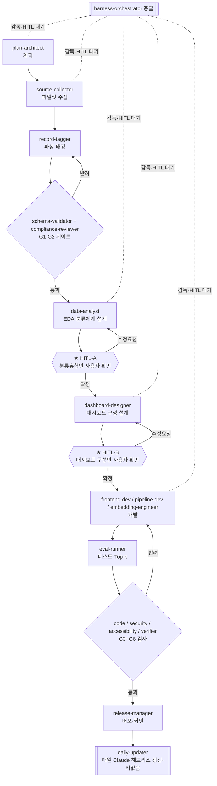

# 감사 선례 도우미 — 세부 구축 계획서 & 에이전트 하네스 구성방안 (v2)

> 대상: `audit-helper` 저장소 / 기준일: 2026-09-05 / v2 개정: 웹 제품 관점 강화
> 짝 문서: [`docs/PRD.md`](PRD.md) · [`CLAUDE.md`](../CLAUDE.md) · [`schema/finding.schema.json`](../schema/finding.schema.json)
> **v2 개정 취지:** 이 과제는 데이터 파이프라인이 아니라 **웹 제품**이다. 제품 가치는 ①**수집 데이터를 어떻게 분류(taxonomy)하고** ②**대시보드로 어떻게 보여주느냐**에 있다. 따라서 "수집 → 분석·분류 → **사람 확인** → 대시보드 설계 → **사람 확인** → 개발" 순서를 아키텍처의 척추로 삼는다.

---

## 0. 현황 진단

| 구분 | 상태 | 근거 |
|---|---|---|
| 데이터 스키마 | ✅ 완성 | `finding.schema.json` — 지적·면책·컨설팅 통합 |
| 검색 앱(F1 일부) | 🟡 PoC | `app/app.js` — 키워드+필드 필터만 |
| 수집 / 파싱 / 임베딩 | ⛔ 스텁 | `collect.py`·`structure.py`·`embed.py` 전부 `NotImplemented` |
| **분류체계(taxonomy)** | ⛔ 없음 | `finding_type`이 자유서술 — 통제어휘 없음 |
| **대시보드** | ⛔ 없음 | 집계·시각화 화면 자체가 없음 |
| 일일배치 | 🟡 골격 | `daily_update.sh`(Claude 헤드리스) 대기 |
| 샘플 | ✅ 9건 | 전부 `_synthetic:true` |

**핵심 공백:** 실데이터가 없으니 **분류체계도, 대시보드 구성도 확정할 수 없다.** → 먼저 데이터를 모으고, 그 데이터를 근거로 분류·대시보드를 제안하고, **사용자 확인을 받은 뒤** 개발한다.

---

## 1. 구축 원칙

### 1.1 절대규칙을 게이트로 내장 (변경 없음)
CLAUDE.md 5대 절대규칙 → G1~G6 자동 검사 게이트로 강제(§5).

### 1.2 사람 확인 게이트 (HITL) — v2 신설 ★
개발 전에 **반드시 사용자 확인을 받는 2개 관문**을 둔다. 오케스트레이터는 이 관문을 건너뛸 수 없다.

- **HITL-A 〔분류체계 확인〕** — 파일럿 수집·분석 후, **자료 분류 유형안**을 사용자에게 제시 → 확정/수정 → 그 후에만 태깅 확정·개발 진행.
- **HITL-B 〔대시보드 구성 확인〕** — **대시보드 구성안**(무엇을·어떤 화면으로)을 사용자에게 제시 → 확정/수정 → 그 후에만 화면 개발 착수.

### 1.3 키 정책 & 일일 업데이트 (사용자 지시 반영) ★
- **수집 = 인증키 절대 금지.** 공개 페이지를 Claude가 직접 읽는다.
- **키는 오직 법제처 OC(F4 조문)만.**
- **일일 업데이트 = 이 Claude(Claude Code)와 연결해 매일 자동 실행.** API 키를 쓰지 않고, `claude -p`(헤드리스)가 `pipeline/daily_prompt.md`대로 신규 사례를 수집·태깅·append·커밋한다. 별도 임베딩 API도 쓰지 않는다. — 담당: `daily-updater`(§2.2)

### 1.4 단일 접착면
모든 에이전트 입·출력은 `finding.schema.json`을 통과. 분류체계 확정 시 `finding_type`을 **통제어휘(controlled vocabulary)** 로 승격.

---

## 2. 에이전트 하네스 구성 (핵심)

### 2.1 오케스트레이션 패턴

**채택: `Pipeline` × `Producer–Reviewer` × `Supervisor` + `HITL 관문` 삽입.**

- **Pipeline** — 순차 의존: 수집→분석→(확인)→설계→(확인)→개발.
- **Producer–Reviewer** — 생성 에이전트는 자기 산출물을 승인 못 한다. 산출물마다 검수 레인.
- **Supervisor** — `harness-orchestrator`가 단계 배분·게이트 판정·**HITL 관문 대기**·상태(`state.json`) 갱신.

### 2.2 에이전트 카탈로그 (v2 — 신규 5종 추가)

> 매핑 = OMC 기존 에이전트 재사용. 신규 = 이 도메인 전용 정의 필요(`.claude/agents/`). ★ = v2 신규 보강.

| 역할군 | 에이전트 | 한 줄 임무 | 입력 → 출력 | 매핑 |
|---|---|---|---|---|
| **총괄** | `harness-orchestrator` | 단계 배분·게이트·HITL 대기·상태 | 계획 → 지시·판정 | 신규(supervisor) |
| **계획** | `plan-architect` | 기능→마일스톤·수락기준 | PRD → 작업그래프 | `planner`/`architect` |
| **수집** | `source-collector` | 공개소스 키 없이 원문 수집 | 소스키 → `raw_docs/*` | `explore`+신규 |
| **파싱·태깅** | `record-tagger` | 원문→스키마 레코드 태깅 | raw → 후보 레코드 | 신규(품질핵심) |
| **분석·분류 ★** | `data-analyst` | 실데이터 탐색(EDA)·**분류체계 설계** | 레코드 → **분류유형안** | `scientist`/`analyst`+신규 |
| **설계(대시보드) ★** | `dashboard-designer` | **대시보드·시각화 구성 설계** | 분류·데이터 → **화면 구성안** | `designer`+`dataviz` 스킬 |
| **검수(데이터)** | `schema-validator` | 스키마 적합·id 중복 | 후보 → 통과/반려 | `verifier`+신규 |
| **검수(규칙)** | `compliance-reviewer` | 5대 절대규칙 준수 | 후보+원문 → 통과/반려 | `code-reviewer`/`critic`+신규 |
| **임베딩** | `embedding-engineer` | 검색용 벡터 생성(키 없이) | findings → `embeddings.json` | `scientist`+신규 |
| **개발(FE)** | `frontend-dev` | 검색·기능 화면 구현 | 스펙 → `app/*` | `executor`/`designer` |
| **개발(파이프)** | `pipeline-dev` | collect/structure/embed 코드화 | 스펙 → `pipeline/*` | `executor` |
| **개발(법령)** | `legal-api-dev` | F4 법제처 OC(후속) | legal_basis → 조문 | `executor`+재사용 |
| **테스트** | `eval-runner` | 정답셋 Top-k·근거유효율 | 골든셋 → 점수 | `test-engineer`/`qa-tester` |
| **검사(코드)** | `code-reviewer` | 결함·단순화 | diff → 지적 | `code-reviewer` |
| **검사(보안)** | `security-reviewer` | 개인정보·망분리·라이선스 | 변경 → 위험 | `security-reviewer` |
| **검사(접근성) ★** | `accessibility-reviewer` | **KWCAG/웹접근성** 점검 | 화면 → 위반 | `design:accessibility-review` 스킬 |
| **검사(완료)** | `verifier` | 마일스톤 증거기반 완료판정 | 산출물 → 완료/미완 | `verifier` |
| **배포·운영 ★** | `release-manager` | 정적배포·git 커밋 자동화 | 변경 → 배포 | `git-master`/`release` |
| **일일운영 ★** | `daily-updater` | **Claude 헤드리스 매일 자동 갱신(키 없음)** | 스케줄 → 신규 append·커밋 | 신규(orchestrator+collector) |

> **에이전트 수가 많아 보이지만** 상당수는 동일 OMC 에이전트가 다른 모자를 쓰는 것(예: `data-analyst`·`embedding-engineer`는 `scientist` 기반)이며, Phase별로 소수만 동시 가동한다.

### 2.3 파이프라인 흐름 (HITL 관문 포함)



---

## 3. 단계별 세부 계획 (Phase) — v2 재배열

### Phase 0 — 하네스 스캐폴딩 (0.5일)
- **담당:** `harness-orchestrator`, `plan-architect`
- **산출물:** `.claude/agents/*.md`(위 에이전트), 게이트 스크립트 `pipeline/validate.py`(G1·G2)
- **수락기준:** `validate.py`가 샘플 9건 전건 통과.

### Phase 1 — 파일럿 데이터 수집 (2~3일)
- **담당:** `source-collector` → `record-tagger` → `schema-validator`·`compliance-reviewer`
- **대상:** **ALIO 지적사항**(정형 웹, 가장 쉬움) 우선 → 가능하면 국회 결산·감사원 일부 추가.
- **산출물:** 실데이터 `data/findings.json`(분류체계 도출에 충분한 표본, 목표 ≥100건), `raw_docs/*`, 로그.
- **수락기준:** G1·G2 전건 통과, 무근거·처분추정·출처누락 0건.

### Phase 2 — 탐색분석 + 분류체계 설계 → ★ HITL-A (2일)
- **담당:** `data-analyst`
- **하는 일:** 수집 데이터 EDA — 업무유형 분포, `finding_type` 자유서술을 군집화해 **통제어휘 후보** 도출(예: `계약 › 수의계약 부당 / 분할계약 / 과업변경 부당`), 처분·기관·연도·법령 교차분석.
- **산출물:** `docs/taxonomy-proposal.md` — 2~3단 분류 체계안 + 근거(빈도·예시) + 대안.
- **관문:** **사용자에게 분류유형안 제시 → 확정/수정 받은 뒤 다음 단계.** (미확정 시 개발 착수 금지)

### Phase 3 — 대시보드·검색 UX 구성 설계 → ★ HITL-B (2일)
- **담당:** `dashboard-designer` (+`dataviz` 스킬)
- **하는 일:** 확정된 분류를 어떻게 보여줄지 설계 — KPI 카드, 반복지적 Top, 업무유형별·기관별·연도 추세, **지적↔면책 비율(안전판)**, 법령별 빈발 등 후보와 화면 레이아웃(와이어) 제안.
- **산출물:** `docs/dashboard-proposal.md`(구성안·와이어) + 필요 시 HTML 목업.
- **관문:** **사용자에게 대시보드 구성안 제시 → 확정/수정 받은 뒤 화면 개발.**

### Phase 4 — 개발 (3~4일)
- **담당:** `frontend-dev`(대시보드+검색 UI), `embedding-engineer`(F1 시맨틱, 키 없이 사전계산), `pipeline-dev`(collect/structure/embed 정식 코드화)
- **산출물:** 대시보드 화면, 하이브리드 검색(키워드+시맨틱), F2 체크리스트, F8 지적↔면책 대조, F10 신규 피드.
- **수락기준:** 확정 구성안대로 렌더, 실데이터로 동작.

### Phase 5 — 테스트 · 검사 (2일)
- **담당:** `eval-runner`(Top-k·근거유효율), `code-reviewer`, `security-reviewer`, `accessibility-reviewer`(KWCAG), `verifier`
- **수락기준:** 정답셋 Top-5 기준선 확보, 접근성 위반 0(치명), 보안·완료 게이트 통과.

### Phase 6 — 일일 자동 운영 + 후속 (상시)
- **담당:** `daily-updater`(매일 Claude 헤드리스, 키 없음), `release-manager`
- **하는 일:** `scripts/daily_update.sh` 크론/스케줄 등록 → 매일 신규만 append(중복 0) → `review:true` 검수 큐 → 커밋·재배포.
- **후속:** F4 법제처(`korean-law` 재사용) · F5 발굴보드 · F9 예산연결(`나라예산 한눈에` 재사용, 라이선스 확인).

---

## 4. 참고: 분류체계·대시보드 사전 가설 (수집 후 검증 대상, 확정 아님)

> 아래는 **방향 공유용 가설**이다. 실데이터 없이는 확정하지 않으며, Phase 2·3에서 데이터로 검증한 뒤 HITL로 확정한다.

**분류 축 가설**
- 기존 스키마 축: `record_type`(지적/면책/컨설팅) · `work_type`(업무유형) · `org_type`(기관) · `year` · `legal_basis`(법령)
- **신설 후보(데이터에서 도출):** `업무유형 › 지적세부유형` 2단 통제어휘. 예: `계약 › {수의계약 부당, 분할계약, 과업변경 부당}`, `보조금 › {정산 소홀, 목적외 사용}`, `여비 › {부당 수령}`
- 부가 축 후보: 처분 강도, 반복빈도(패턴), 면책 인정요건 유형.

**대시보드 화면 가설**
- 상단 KPI: 총 사례수 · 지적/면책/컨설팅 비율 · 신규(added_at) 건수
- 반복지적 Top N (업무유형×지적세부유형)
- 업무유형별·기관유형별 분포 (막대)
- 연도 추세 (라인)
- **지적↔면책 안전판:** "이 유형에서 면책 인정 N건" 비율
- 근거법령 빈발 Top · 처분종류 분포

---

## 5. 품질 게이트

| 게이트 | 담당 | 검사 | 방식 |
|---|---|---|---|
| G1 스키마 | `schema-validator` | 필수필드·enum·id중복 | 결정론 100% |
| G2 절대규칙 | `compliance-reviewer` | 출처·처분표기·무근거·현행성·위법단정 | 규칙+LLM |
| G3 코드 | `code-reviewer` | 결함·단순화·성능 | `code-review` |
| G4 보안 | `security-reviewer` | 개인정보·망분리·라이선스 | OWASP+도메인 |
| **G5 접근성 ★** | `accessibility-reviewer` | KWCAG(대비·키보드·대체텍스트) | `accessibility-review` |
| G6 완료 | `verifier` | Top-k·수락기준 증거 | 증거기반 |
| **HITL-A/B ★** | 사용자 | 분류체계·대시보드 구성 확정 | 수동 승인 |
| G7 검수큐 | 실무자 | `review:true` 최종 노출 승인 | 수동 |

---

## 6. 하네스 기동 & 즉시 착수

```bash
/team                        # 오케스트레이터가 Phase별 에이전트 배분
bash scripts/daily_update.sh # 일일: Claude 헤드리스가 키 없이 수집·태깅·커밋
```

**다음 액션(사용자 지시 대기):**
1. Phase 0 스캐폴딩(에이전트·게이트 파일 생성)
2. **Phase 1 파일럿 수집 시작** — 소스·표본량 확정 후 착수 → 그 데이터로 HITL-A(분류안) 제시.
